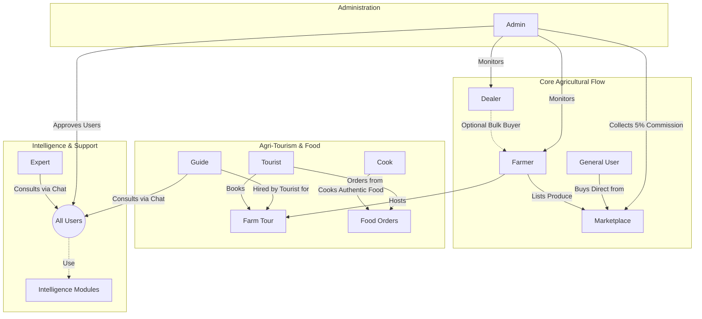
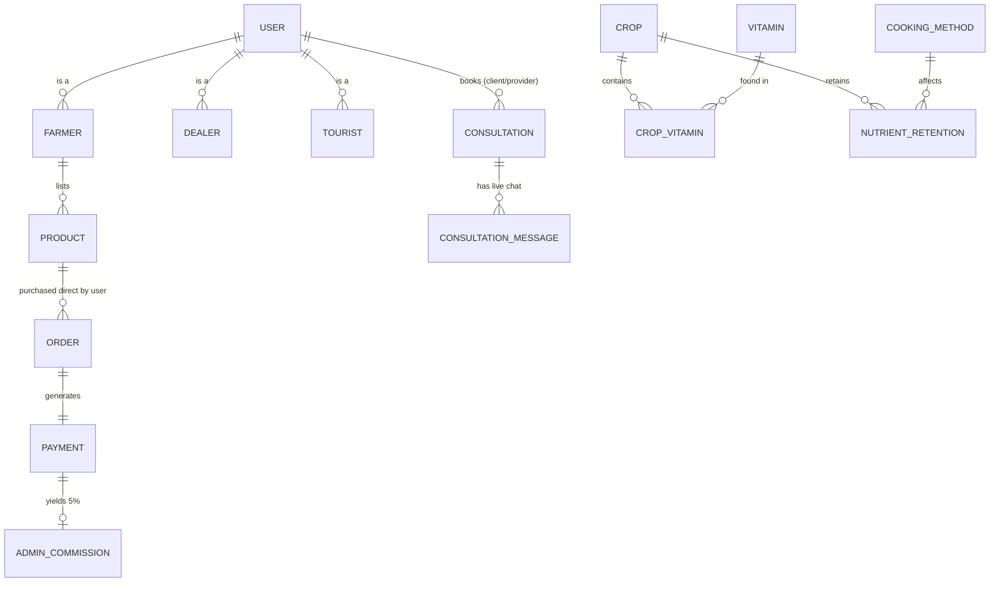

# 🌱 KrishiDisha

**KrishiDisha** is a comprehensive, database-driven agricultural intelligence platform designed to connect farmers, traders, tourists, experts, and consumers in a single unified ecosystem. 

It acts as a decision support system, an agricultural marketplace, an agri-tourism booking platform, and a nutritional intelligence tool. Built using **PHP, MySQL, and Bootstrap 5**, it leverages role-based access control to provide tailored dashboards and tools for eight distinct user types.

---

## 🎯 The Ecosystem Visualized



---

## 👥 Role-Based Access & Dashboards

The system enforces strict Role-Based Access Control (RBAC). Each role has a dedicated dashboard with specific capabilities:

| Role | Responsibilities & Access |
| :--- | :--- |
| 🛡️ **Admin** | Manages platform content, approves entity registrations (Cooks, Experts, Guides), tracks 5% marketplace commissions, and oversees system integrity. |
| 🧑‍🌾 **Farmer** | Lists agricultural produce directly to the Marketplace (D2C), manages farmlands for tourist visits, and books consultations. |
| 🏬 **Dealer** | Operates primarily in bulk B2B operations and manages secondary inventory. |
| 🧳 **Tourist** | Explores and books Agri-tourism farm tours, hires local guides, orders authentic regional food, and can book expert/guide consultations. |
| 🧑‍🍳 **Cook** | Creates and manages recipes (especially marking them as "Authentic") and fulfills food orders placed by tourists. |
| 🔬 **Expert** | Provides agricultural consultation services to all users. Features a live discussion/chat interface for ongoing advice. |
| 🗺️ **Guide** | Offers guiding services for farm tours and paid general consultations with users. Features live chat for sharing tips. |
| 👤 **General User** | Browses the Marketplace to purchase crops directly from Farmers, accesses intelligence tools, and books live consultations. |

---

## 🧩 Core Modules

KrishiDisha is packed with intelligent modules accessible to users based on their roles:

### 1. 🛒 The Marketplace
A Direct-to-Consumer (D2C) trading system. Farmers list raw produce directly to the marketplace where General Users and Tourists can buy it instantly, cutting out the middlemen. The system automatically calculates and records a **5% commission** for the Admin on all sales.

### 2. 📖 Crop Encyclopedia
A searchable, filterable database of crops (recently expanded with Eggplant, Chili, Onion, etc.). Users can filter by season (Summer, Winter, All Year) and Category (Grain, Vegetable, Fruit, etc.). It includes dynamic modal views for deep-dive nutritional data.

### 3. 🦠 Disease Detection
Farmers can search through an expanded database of known crop diseases (including Eggplant Shoot Borer, Chili Leaf Curl, etc.). The module provides symptoms, prevention methods, and recommended chemical/organic treatments.

### 4. 🧠 Crop Recommender
A dual-mode intelligence tool:
* **Region-Based:** Suggests the best crops to plant based on the user's selected division/region using suitability scoring.
* **Nutrition-Based:** Suggests crops based on specific vitamin deficiencies (e.g., Vitamin A, Vitamin C).

### 5. 🥗 Nutrition & Cooking Retention
An advanced tool that calculates nutrient retention. Users select a crop and a cooking method (e.g., Boiling, Frying, Steaming), and the system outputs dynamic progress bars showing the percentage of vitamins retained after cooking.

### 6. 💰 Farm Profit Calculator
A JavaScript-powered estimation tool. Farmers input their land size and crop, and the system pulls reference market prices from the database to calculate potential revenue, estimated costs, and net profit per acre.

### 7. 🚜 Agri-Tourism & Consultations
A booking engine connecting Tourists with Farmers (for farm tours) and Guides. Also features a **Unified Consultation Portal** where *any* user can book a session with an Expert or a Tour Guide. It includes a built-in **Live Discussion/Chat** feature where clients and providers can exchange ongoing tips and advice.

---

## ⚙️ Technology Stack

* **Frontend:** HTML5, CSS3 (Custom Variables), Bootstrap 5, FontAwesome, JavaScript (Vanilla)
* **Backend:** PHP 8+ (PDO for secure database interactions)
* **Database:** MySQL 8.0 (Relational schema with 26 tables)
* **Environment:** Docker (containerized Apache/PHP & MySQL)

---

## 🗄️ Database Architecture

The platform relies on a highly normalized MySQL database (`krishidisha.sql`). Key architectural features include:



* **Data Integrity:** Strict Foreign Key constraints (e.g., cascading deletes for user profiles).
* **Security:** All passwords are hashed using `password_hash()`. SQL Injection is prevented using PDO Prepared Statements.
* **Transactions:** Complex operations (like ordering a product and deducting stock) use SQL `BEGIN TRANSACTION` and `COMMIT` to ensure atomic operations.

---

## 🚀 How to Run Locally with Docker

The project includes a `docker-compose.yml` and `Dockerfile` that will automatically build the web server, install PHP extensions, spin up MySQL, and auto-import the seed data.

1. Ensure **Docker** and **Docker Compose** are installed and running on your system.
2. Open a terminal in the project directory.
3. Run the following command to start the containers in the background:
   ```bash
   docker compose up -d
   ```
4. Access the platform at: [http://localhost:8080/KrishiDisha/](http://localhost:8080/KrishiDisha/)
5. Access phpMyAdmin at: [http://localhost:8081/](http://localhost:8081/)
6. To stop the application, run:
   ```bash
   docker compose down
   ```

---
*Built as a scalable, intelligence-driven platform for modern agriculture.*
