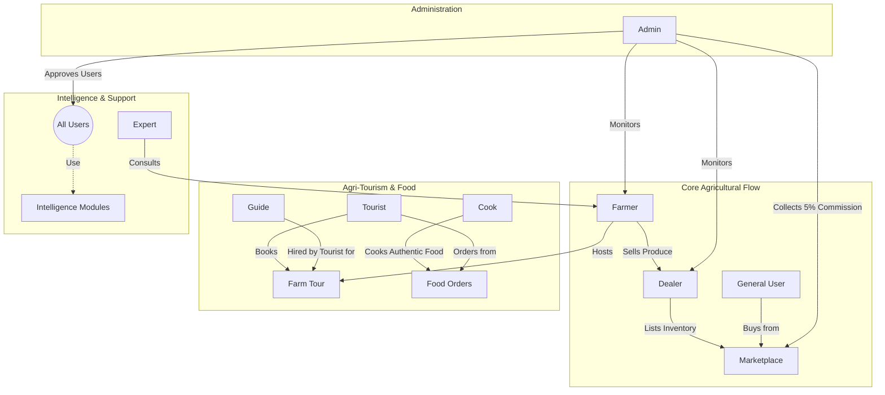
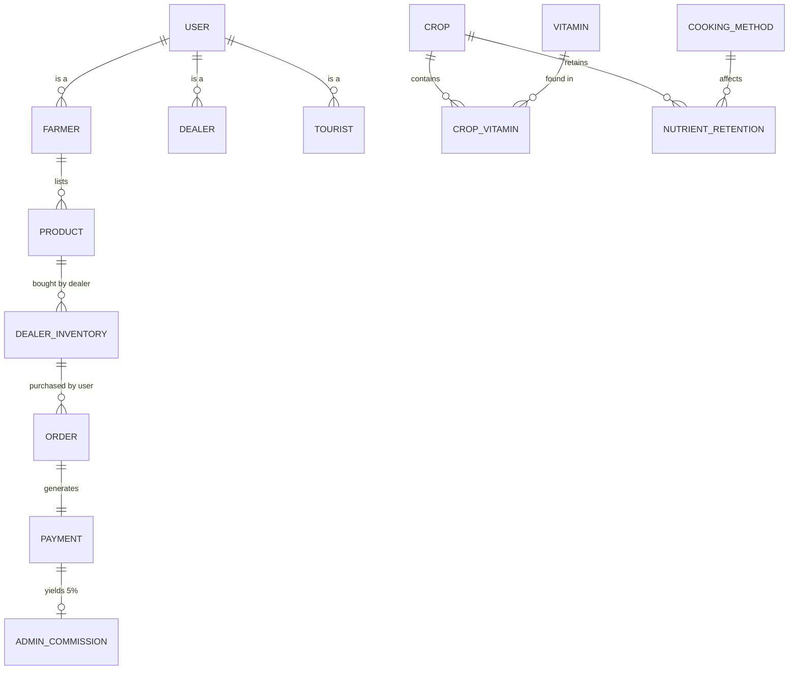

# 🌱 KrishiDisha

**KrishiDisha** is a comprehensive, database-driven agricultural intelligence platform designed to connect farmers, traders, tourists, experts, and consumers in a single unified ecosystem. 

It acts as a decision support system, an agricultural marketplace, an agri-tourism booking platform, and a nutritional intelligence tool. Built using **PHP, MySQL, and Bootstrap 5**, it leverages role-based access control to provide tailored dashboards and tools for eight distinct user types.

---

## 🎯 The Ecosystem Visualized



---

## 👥 Role-Based Access & Dashboards

The system enforces strict Role-Based Access Control (RBAC). Each role has a dedicated dashboard with specific capabilities:

| Role | Responsibilities & Access |
| :--- | :--- |
| 🛡️ **Admin** | Manages platform content, approves entity registrations (Cooks, Experts, Guides), tracks 5% marketplace commissions, and oversees system integrity. |
| 🧑‍🌾 **Farmer** | Lists agricultural produce for sale, manages farmlands for tourist visits, and hires agricultural experts for consultations. |
| 🏬 **Dealer** | Acts as a middleman. Buys bulk produce from Farmers, sets markup prices, and manages stock inventory in the Marketplace. |
| 🧳 **Tourist** | Explores and books Agri-tourism farm tours, hires local guides, and orders authentic regional food from verified cooks. |
| 🧑‍🍳 **Cook** | Creates and manages recipes (especially marking them as "Authentic") and fulfills food orders placed by tourists. |
| 🔬 **Expert** | Provides agricultural consultation services to farmers. Manages session requests (accept/complete) and tracks earnings. |
| 🗺️ **Guide** | Offers guiding services for farm tours. Manages bookings requested by tourists and tracks tour schedules. |
| 👤 **General User** | Browses the Marketplace to purchase crops from Dealers, and accesses the nutrition and crop intelligence tools. |

---

## 🧩 Core Modules

KrishiDisha is packed with intelligent modules accessible to users based on their roles:

### 1. 🛒 The Marketplace
A multi-tier trading system. Farmers list raw produce -> Dealers purchase bulk produce and set a retail markup -> General Users and Tourists buy the retail produce. The system automatically calculates and records a **5% commission** for the Admin on retail sales.

### 2. 📖 Crop Encyclopedia
A searchable, filterable database of crops. Users can filter by season (Summer, Winter, All Year) and Category (Grain, Vegetable, Fruit, etc.). It includes dynamic modal views for deep-dive nutritional data.

### 3. 🦠 Disease Detection
Farmers can search through a database of known crop diseases. The module provides symptoms, prevention methods, and recommended chemical/organic treatments.

### 4. 🧠 Crop Recommender
A dual-mode intelligence tool:
* **Region-Based:** Suggests the best crops to plant based on the user's selected division/region using suitability scoring.
* **Nutrition-Based:** Suggests crops based on specific vitamin deficiencies (e.g., Vitamin A, Vitamin C).

### 5. 🥗 Nutrition & Cooking Retention
An advanced tool that calculates nutrient retention. Users select a crop and a cooking method (e.g., Boiling, Frying, Steaming), and the system outputs dynamic progress bars showing the percentage of vitamins retained after cooking.

### 6. 💰 Farm Profit Calculator
A JavaScript-powered estimation tool. Farmers input their land size and crop, and the system pulls reference market prices from the database to calculate potential revenue, estimated costs, and net profit per acre.

### 7. 🚜 Agri-Tourism & Consultations
A booking engine connecting Tourists with Farmers (for farm tours) and Guides. Also connects Farmers with Agricultural Experts for paid consultation sessions.

---

## ⚙️ Technology Stack

* **Frontend:** HTML5, CSS3 (Custom Variables), Bootstrap 5, FontAwesome, JavaScript (Vanilla)
* **Backend:** PHP 8+ (PDO for secure database interactions)
* **Database:** MySQL 8.0 (Relational schema with 26 tables)
* **Environment:** Docker (containerized Apache/PHP & MySQL) OR local XAMPP/WAMP.

---

## 🗄️ Database Architecture

The platform relies on a highly normalized MySQL database (`krishidisha.sql`). Key architectural features include:



* **Data Integrity:** Strict Foreign Key constraints (e.g., cascading deletes for user profiles).
* **Security:** All passwords are hashed using `password_hash()`. SQL Injection is prevented using PDO Prepared Statements.
* **Transactions:** Complex operations (like ordering a product and deducting stock) use SQL `BEGIN TRANSACTION` and `COMMIT` to ensure atomic operations.

---

## 🚀 How to Run Locally

### Option 1: Using Docker (Recommended)
The project includes a `docker-compose.yml` and `Dockerfile` that will automatically build the web server, install PHP extensions, spin up MySQL, and auto-import the seed data.

1. Install Docker Desktop.
2. Open a terminal in the project directory.
3. Run the following command:
   ```bash
   docker compose up -d
   ```
4. Access the platform at: `http://localhost:8080/KrishiDisha/`
5. Access phpMyAdmin at: `http://localhost:8081/`

### Option 2: Using XAMPP / WAMP
1. Move the `KrishiDisha` folder into your `htdocs` (XAMPP) or `www` (WAMP) directory.
2. Open phpMyAdmin (`http://localhost/phpmyadmin`).
3. Create a new database named `krishidisha`.
4. Import the `/database/krishidisha.sql` file.
5. In `config/db.php`, ensure `DB_HOST` is set to `localhost`.
6. Access the platform at: `http://localhost/KrishiDisha/`

---
*Built as a scalable, intelligence-driven platform for modern agriculture.*
