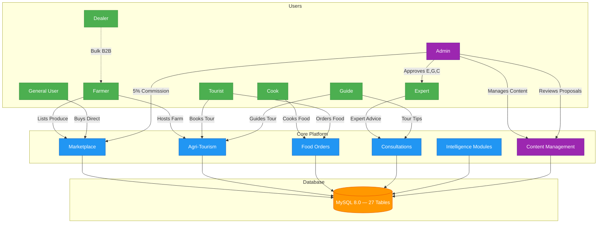
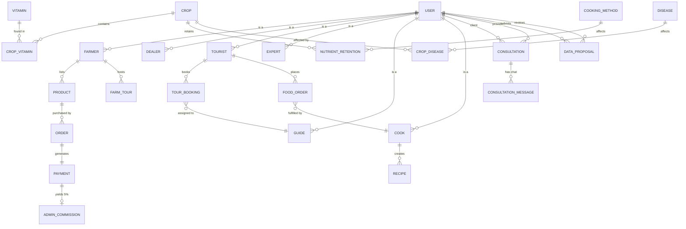

<div align="center">

# 🌱 KrishiDisha

### Agricultural Intelligence Platform
#### *Farm → Fork → Future*

<br/>

**An end-to-end agricultural intelligence ecosystem — connecting farmers, markets, tourists, experts, and consumers on a single platform.**

<br/>


<br/>

[](#-quick-start-with-docker)
[](#️-database-architecture)
[](#-role-based-access-control)

</div>

---

## 🌍 What is KrishiDisha?

> **কৃষিদিশা** *(Krishi = Agriculture | Disha = Direction/Path)*

KrishiDisha is a full-stack, database-driven **agricultural intelligence platform** built to empower every stakeholder in the food chain — from the farmer in the field to the consumer at the table.

| 🛒 Marketplace | 📚 Intelligence Hub | 🌿 Tourism Engine | 🤝 Consultation Network |
|:---:|:---:|:---:|:---:|
| Direct-to-consumer produce trading with auto 5% commission tracking | Crop encyclopedia, disease detection, profit calculator & nutrition analyzer | Farm tour bookings with guide hiring & authentic rural food ordering | Live expert & guide chat consultations for all users |

---

## 🏗️ Platform Architecture



---

## 🎭 Role-Based Access Control

The platform enforces **strict RBAC** — each of the 8 roles gets a personalized dashboard with dedicated tools:

<table>
<tr>
  <th>Role</th>
  <th>Key Actions</th>
  <th>Core Dashboard Pages</th>
</tr>
<tr>
  <td>🛡️ <b>Admin</b></td>
  <td>Approve users, manage all content (CRUD + photos), review proposals, track commissions</td>
  <td><code>admin/dashboard.php</code> · <code>admin/manage_content.php</code> · <code>admin/proposals.php</code> · <code>admin/approvals.php</code> · <code>admin/commissions.php</code></td>
</tr>
<tr>
  <td>🧑‍🌾 <b>Farmer</b></td>
  <td>List produce for D2C sales, host farm tours, book consultations, suggest content</td>
  <td><code>farmer/produce.php</code> · <code>farmer/farmland.php</code></td>
</tr>
<tr>
  <td>🏬 <b>Dealer</b></td>
  <td>Manage bulk B2B inventory and secondary trade operations</td>
  <td><code>dealer/inventory.php</code> · <code>dealer/sales.php</code></td>
</tr>
<tr>
  <td>🧳 <b>Tourist</b></td>
  <td>Book farm tours, hire guides, order authentic food, consult experts, suggest content</td>
  <td><code>tourist/tours.php</code> · <code>tourist/food_orders.php</code></td>
</tr>
<tr>
  <td>🧑‍🍳 <b>Cook</b></td>
  <td>Create authentic recipes, fulfill tourist food orders</td>
  <td><code>cook/recipes.php</code> · <code>cook/orders.php</code></td>
</tr>
<tr>
  <td>🔬 <b>Expert</b></td>
  <td>Provide crop & soil consultations, engage via live chat</td>
  <td><code>expert/sessions.php</code></td>
</tr>
<tr>
  <td>🗺️ <b>Guide</b></td>
  <td>Guide farm tours, offer tourism consultation via live chat</td>
  <td><code>guide/bookings.php</code> · <code>guide/sessions.php</code></td>
</tr>
<tr>
  <td>👤 <b>General User</b></td>
  <td>Browse marketplace, buy from farmers, access all intelligence tools</td>
  <td><code>user/marketplace.php</code> · <code>user/nutrition.php</code></td>
</tr>
</table>

---

## 🧩 Core Feature Modules

### 🛒 1. Direct-to-Consumer Marketplace

```
Farmer lists crop ──► Marketplace shows listing (with photo) ──► User places order
                                                                       │
                              ┌────────────────────────────────────────┤
                              ▼                                         ▼
                        Stock deducted                      5% commission recorded
                        from PRODUCT                        in ADMIN_COMMISSION
```

- Farmers publish produce with price, quantity, and **product photo**
- Users buy directly — no middlemen
- Every transaction auto-calculates **5% admin commission**
- Atomic DB transactions prevent overselling (`BEGIN TRANSACTION ... COMMIT`)
- **Admin can edit, approve, or remove any listing** from `manage_content.php`

---

### 📖 2. Crop Encyclopedia

- Full-text **search** across crop name, local (Bangla) name, scientific name, and description
- Filter by **Season** (Summer, Winter, Rainy, All Year) and **Category** (Grain, Vegetable, Fruit…)
- Each crop card displays its **uploaded photo** (falls back to category emoji)
- Admin gets inline ✏️ Edit / 🗑️ Delete buttons on every card
- Logged-in non-admin users see a **💡 Suggest Crop** button to submit a proposal

---

### 🦠 3. Disease Detection Engine

- Search by crop name or disease symptom
- Each disease card displays its **uploaded photo** where available
- Returns **Symptoms**, **Affected Plant Part**, **Organic Solutions**, and **Chemical Treatments**
- Admin gets inline edit/delete controls; users can **Suggest a Disease**

---

### 🧠 4. Dual-Mode Crop Recommender

```
┌─────────────────────────────────────┐
│          CROP RECOMMENDER           │
├──────────────────┬──────────────────┤
│  🗺️ By Region   │  💊 By Nutrition │
├──────────────────┼──────────────────┤
│  Select Division │  Select Vitamin  │
│  e.g. "Sylhet"  │  e.g. "Vitamin A"│
│        ▼         │        ▼         │
│  Ranked crops by │  Crops richest   │
│  suitability     │  in that vitamin │
│  score DESC      │  from DB         │
└──────────────────┴──────────────────┘
```

Users (and farmers) can **suggest new region–crop suitability entries** via the proposal system.

---

### 🥗 5. Nutrition & Cooking Retention Analyzer

- Select a **crop** + **cooking method** (Boiling, Frying, Steaming, Raw)
- Animated **progress bars** show % of vitamins retained post-cooking
- Backed by the `CROP_VITAMIN` and `COOKING_METHOD` tables
- Users can **suggest nutrient retention data** via the proposal system

---

### 💰 6. Farm Profit Calculator

- JavaScript-powered, **no page refresh**
- Input: land size (acres) + crop type
- Pulls live market prices from DB → outputs **Revenue**, **Cost**, **Net Profit**

---

### 🌿 7. Agri-Tourism

```
Tourist ──► Books Farm Tour (with photo preview) ──► Farmer confirms
        └──► Hires Guide ──────────────────────────► Guide accepts
        └──► Orders Food ─────────────────────────► Cook fulfills
        └──► Books Expert ────────────────────────► Live Chat begins
                                                          │
                                                 CONSULTATION_MESSAGE
                                                 table stores all msgs
```

- Tour cards display **real farm photos** uploaded by admin
- Searchable by title or location
- Admin can add/edit/delete tours and **approve pending tours** from manage_content

---

### 🛡️ 8. Admin Content Management System *(new)*

A full CMS for the platform's editorial content:

```
admin/manage_content.php
│
├── 🌱 Crops Tab     — Add / Edit / Delete crops with photo upload
├── 🦠 Diseases Tab  — Add / Edit / Delete diseases, link to affected crops
├── 🌿 Tours Tab     — Add / Edit / Delete farm tour listings with photos
└── 🛒 Marketplace   — Approve / Edit / Remove farmer-listed products
```

- **Image uploads** stored in `assets/images/uploads/{crops,diseases,tours,products}/`
- Live filterable tables for quick record management
- Confirmation prompts guard all destructive actions

---

### 📬 9. User Proposal & Admin Approval Workflow *(new)*

Any authenticated user can **suggest new content** which enters a moderation queue:

```
User submits suggestion (modules/suggest.php)
         │
         ▼
DATA_PROPOSAL record created (status = 'pending')
         │
         ▼
Admin reviews in proposals.php
         │
    ┌────┴────┐
    ▼         ▼
Approve     Reject (with reason)
    │
    ▼
Auto-inserted into correct table
(CROP / DISEASE / REGION_CROP / CROP_VITAMIN)
```

**Suggestion categories:**

| Section | What users can suggest |
|:--------|:----------------------|
| 🌱 Crop | New crop with photo, names, season, category, history |
| 🦠 Disease | New disease/pest with photo, symptoms, treatment |
| 📍 Region Suitability | Crop–region–soil suitability scores |
| 🧪 Nutrient Retention | Vitamin retention % for crop + cooking method |

---

## 🗄️ Database Architecture

> **27 tables** structured around a highly normalized relational schema with strict foreign key constraints.



### Notable Schema Additions

| Table | Purpose |
|:------|:--------|
| `DATA_PROPOSAL` | Stores pending user suggestions awaiting admin approval; `proposed_data` is JSON-encoded |
| `CROP.image` | Path to uploaded crop photo |
| `DISEASE.image` | Path to uploaded disease photo |
| `FARM_TOUR.image` | Path to uploaded farm tour photo |
| `PRODUCT.image` | Path to uploaded marketplace product photo |

### 🔒 Security & Data Integrity

| Layer | Implementation |
|:------|:---------------|
| **Password Security** | `password_hash()` + `password_verify()` — no plaintext storage |
| **SQL Injection** | PDO Prepared Statements (`prepare()` + `execute()`) across all queries |
| **Atomic Transactions** | `BEGIN TRANSACTION … COMMIT` for multi-table operations (orders, payments) |
| **Access Control** | `includes/auth_check.php` — every protected page verifies `$_SESSION['role']` |
| **Approval Gate** | Experts, Guides, Cooks start with `status='pending'` — login blocked until Admin approves |
| **Content Moderation** | All user-submitted content held in `DATA_PROPOSAL` with `pending` status until admin reviews |
| **Upload Validation** | File uploads restricted to jpg/jpeg/png/webp/gif; saved with `uniqid()` filenames |

---

## ⚙️ Technology Stack

```
┌─────────────────────────────────────────────────────────────────┐
│                        KrishiDisha Stack                         │
├───────────────┬─────────────────────────────────────────────────┤
│  Frontend     │  HTML5 · Vanilla CSS (Custom Properties)         │
│               │  FontAwesome 6 Icons · Vanilla JavaScript         │
├───────────────┼─────────────────────────────────────────────────┤
│  Backend      │  PHP 8.0+ · PDO · Session Management             │
├───────────────┼─────────────────────────────────────────────────┤
│  Database     │  MySQL 8.0 · 27 Relational Tables                │
├───────────────┼─────────────────────────────────────────────────┤
│  Environment  │  Docker · Docker Compose · Apache · phpMyAdmin    │
├───────────────┼─────────────────────────────────────────────────┤
│  Media        │  Server-side file upload · Organised by entity   │
└───────────────┴─────────────────────────────────────────────────┘
```

---

## 🚀 Quick Start with Docker

> **Prerequisites:** [Docker Desktop](https://www.docker.com/products/docker-desktop/) must be installed and running.

```bash
# 1. Clone the repository
git clone https://github.com/Nazmul1005/Krishi-Disha.git
cd Krishi-Disha

# 2. Start all containers (web server + MySQL + phpMyAdmin)
docker compose up -d

# 3. Visit the platform
open http://localhost:8080/KrishiDisha/
```

### 🌐 Access Points

| Service | URL |
|:--------|:----|
| 🌱 **KrishiDisha App** | [http://localhost:8080/KrishiDisha/](http://localhost:8080/KrishiDisha/) |
| 🗄️ **phpMyAdmin** | [http://localhost:8081/](http://localhost:8081/) |

### 🛑 Stopping the Application

```bash
docker compose down
```

### 📦 What Docker Does Automatically

```
docker compose up
      │
      ├─► Builds PHP 8 + Apache web server
      ├─► Installs PDO MySQL extension
      ├─► Starts MySQL 8.0 container
      ├─► Auto-imports database/krishidisha.sql seed data
      ├─► Creates assets/images/uploads/ directories
      └─► Starts phpMyAdmin on port 8081
```

---

## 📁 Project Structure

```
KrishiDisha/
│
├── 📄 index.php               # Public landing page
├── 🐳 Dockerfile              # PHP + Apache container config
├── 🐳 docker-compose.yml      # Multi-container orchestration
│
├── 🔐 auth/                   # Login, Registration, Logout
├── ⚙️  config/                 # Database connection (db.php)
├── 🔧 includes/               # Shared: sidebar, auth_check, header, footer
│
├── 🛡️  admin/
│   ├── dashboard.php          # Admin overview & stats
│   ├── manage_content.php     # ★ CRUD for crops, diseases, tours, products
│   ├── proposals.php          # ★ Review & approve user-submitted content
│   ├── approvals.php          # Approve pending expert/guide/cook accounts
│   ├── commissions.php        # View 5% commission ledger
│   └── users.php              # Manage all platform users
│
├── 🧑‍🌾 farmer/                 # Farmer dashboard, produce, farmland
├── 🏬 dealer/                 # Dealer dashboard, inventory, sales
├── 🧳 tourist/                # Tourist dashboard, tours, food orders
├── 🧑‍🍳 cook/                   # Cook dashboard, recipes, orders
├── 🔬 expert/                 # Expert dashboard, consultation sessions
├── 🗺️  guide/                  # Guide dashboard, bookings, sessions
├── 👤 user/                   # General user marketplace & tools
│
├── 🧠 modules/                # Shared intelligence modules (all roles)
│   ├── encyclopedia.php       # Crop encyclopedia with search & photos
│   ├── disease.php            # Disease detection with photos
│   ├── recommend.php          # Dual-mode crop recommender
│   ├── nutrition.php          # Nutrition retention analyzer
│   ├── calculator.php         # Farm profit calculator
│   ├── tourism.php            # Agri-tourism listings with search & photos
│   ├── suggest.php            # ★ User content suggestion portal
│   ├── book_consultation.php  # Consultation booking
│   └── consultation_chat.php  # Live chat interface
│
├── 🗄️  database/
│   ├── krishidisha.sql        # Full DB schema + seed data
│   └── update_schema.sql      # Schema migrations (image columns, DATA_PROPOSAL)
│
└── 🎨 assets/
    ├── css/                   # Custom design system (style.css)
    ├── js/                    # Client-side scripts
    └── images/
        └── uploads/           # ★ User/admin uploaded photos
            ├── crops/
            ├── diseases/
            ├── tours/
            └── products/
```

---

## 🔄 Key Workflow Flows

### Authentication Flow
```
User visits index.php
        │
        ▼
   auth/login.php ──[Invalid]──► Error message
        │
   [Valid credentials]
        │
        ▼
$_SESSION['role'] = 'farmer' (or any role)
        │
        ▼
header("Location: farmer/dashboard.php")
        │
   [Every page load]
        │
        ▼
includes/auth_check.php validates session
→ Wrong role? Redirect. No session? Redirect to login.
```

### Content Proposal Workflow
```
User fills suggest.php form (crop / disease / region / nutrition)
        │
        ▼
Photo uploaded to assets/images/uploads/<section>/
        │
        ▼
DATA_PROPOSAL row inserted (status = 'pending', proposed_data = JSON)
        │
        ▼
Admin opens proposals.php → sees data preview + photo thumbnail
        │
        ├──[Approve]──► Auto-INSERT into correct table + status = 'approved'
        │
        └──[Reject]───► Modal asks for reason → status = 'rejected', admin_notes saved
```

### Marketplace Transaction (Atomic)
```sql
BEGIN TRANSACTION;
  INSERT INTO `ORDER` (user_id, product_id, quantity_kg, total_price) VALUES (?, ?, ?, ?);
  UPDATE PRODUCT SET quantity_kg = quantity_kg - ? WHERE id = ?;
  INSERT INTO PAYMENT (payer_id, ref_type, ref_id, amount, status) VALUES (?, 'order', ?, ?, 'completed');
  INSERT INTO ADMIN_COMMISSION (payment_id, commission_rate, commission_amount) VALUES (?, 5.00, total * 0.05);
COMMIT;
```

---

<div align="center">

---

**🌱 KrishiDisha — Bridging the field and the future, one harvest at a time.**

*Built for Bangladeshi agriculture using PHP · MySQL · Docker*

---

</div>
